# VML2 Sales Notes

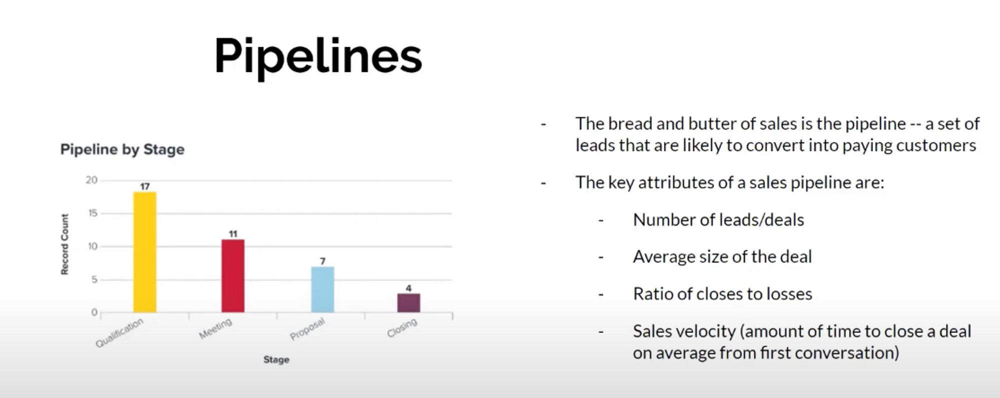

## You rarely sell to a company

- There’s no such thing as “selling to a company”
- Not all people can make decisions
- Always sell to ********************************decision makers********************************  at a company
- Sales is about 1:1 conversations or meetings
- There are many different ways you can find decision makers. and sell your products.

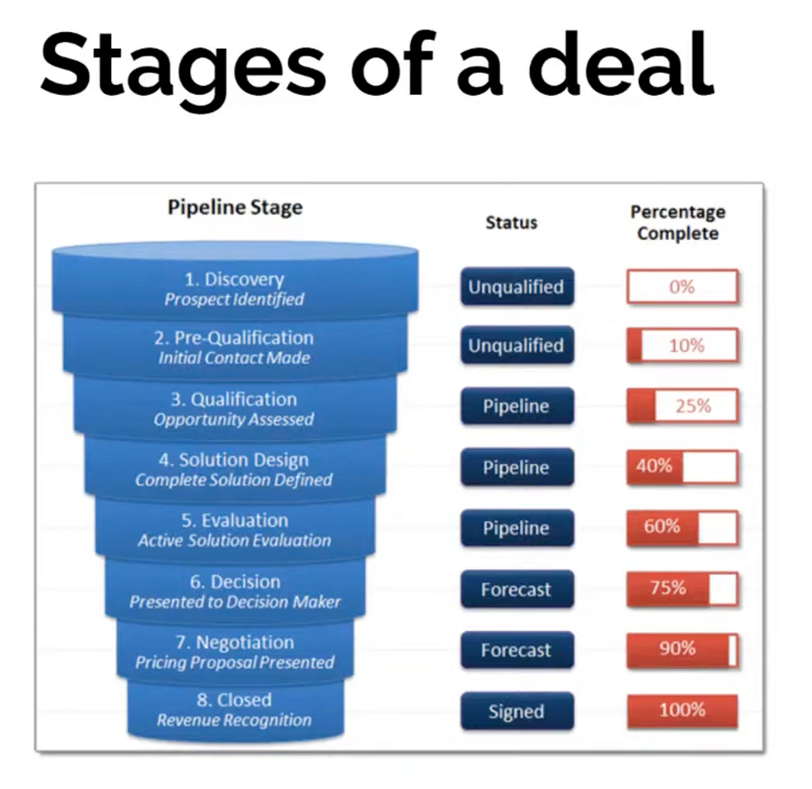

## **Friction**

- Friction is the amount of resistance between a customer and his purchase
- The more time you as a sales rep have to spend with a customer, the more friction there is
- High friction sales take a lot of time and effort

## **Calculating friction**

- Friction score = (time spent by sales rep) * (total number of decision makers)
- Friction is a marker of how low your sales velocity is. It is the inverse of sales velocity

## **Sales velocity**

- A measure of how fast you can close a deal
- If you are an entrepreneur, raise as much capital to cover 2x your sales velocity
- Avoid high friction, low velocity sales (Ex: selling to the government)

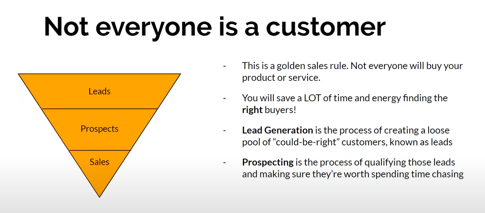

## **Prospecting**

- We prospect by creating an **ideal buyer persona**
- This is a hypothetical person who would be the perfect customer for your product
- Before we start prospecting and initiating conversation, we generate leads in a process called **lead generation**

## **Steps to Lead generation**
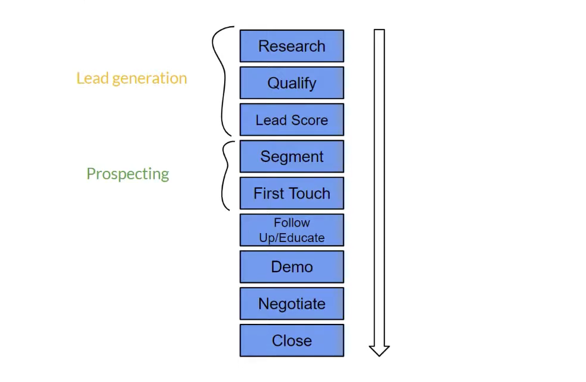

## **Lead generation - 1**

- Use the following matrix to map your ideal buyer persona
- But always remember, at the end of the day, you sell to a person, not a company
- This list just narrows down the companies you want to sell to

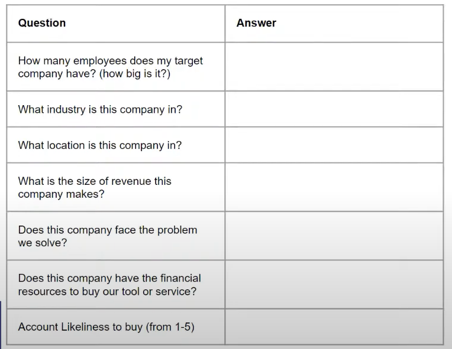

## **Lead generation - 2**

- Once you have figured out the companies you want to sell to, let's move to the buyer

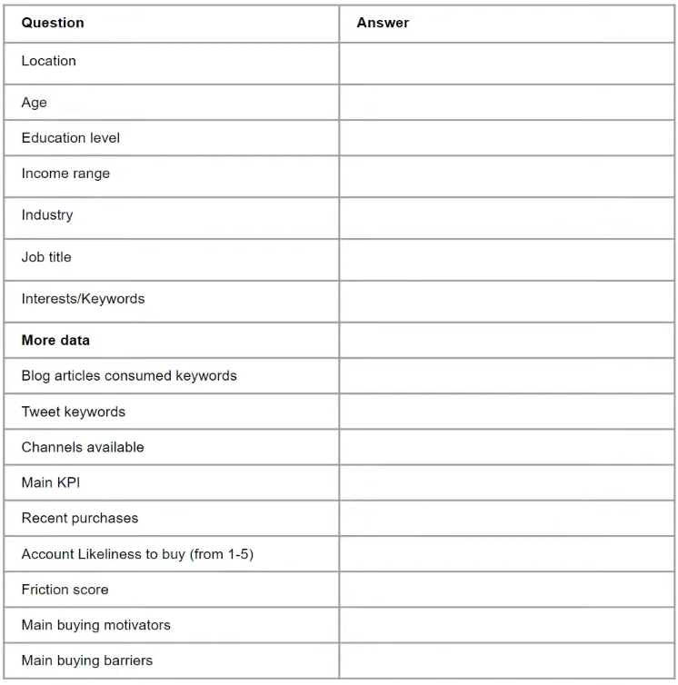

- Now we need to start reaching out to people who fit the buyer persona we have identified
- Sometimes, you might need to reach out to somebody one level lower (bottom up approach) or one level higher (top down approach) than the buyer persona you have identified
- Sometimes, you might be entirely wrong about this persona, in which case, you have to go back to the drawing board and start over
- All of these things take experimentation and time, which is why speeding up how fast you run these persona tests is important!

## **Need a tool?**
- [Hubspot Make My Persona](https://www.hubspot.com/make-my-persona)

## **How does sales interact with marketing?**

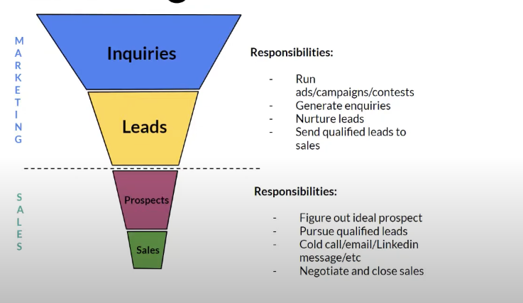

## **Turn your leads into prospects**
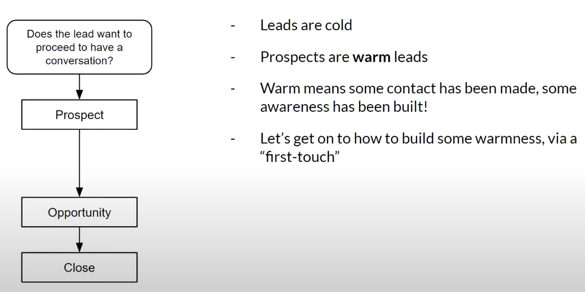

## **First Touch**
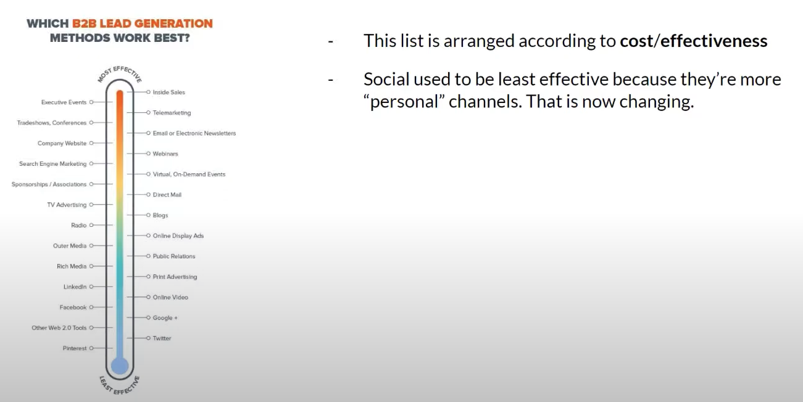
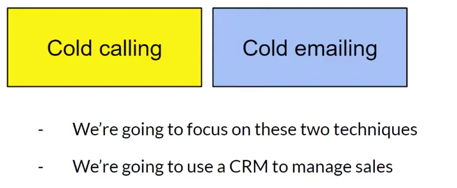

## **Outbound Leadgen using Sales Navigator**

- We're going to use LinkedIn Sales Navigator  along with the Foxbound Chrome extension to generate leads

## **People and companies have "buying windows"**

- A buying window is a time when a company is most likely to buy your product
- For example, if you are selling a product that helps companies with their taxes, the buying window is the end of the financial year
- If you are selling a product that helps companies with their hiring, the buying window is when they are hiring
  
## **Touches**

- In Enterprise sales, the 'double tap' -- the process of leaving a voicemail and sending an email -- is the most effective way to get a response
- Usually this is done everyday once a prospect enters a sales rep's pipeline, for 8 days
- Unless the prospect says a hard no, you then start reaching out to them once a month
- The 8 days tap is less about getting a response, and more about making the prospect aware of your product so they have **recall** when they have a need
- The **monthly taps** are all about actual selling

## **Immediate needs**
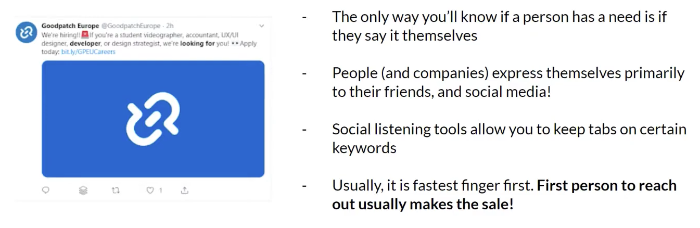

## **Which Social?**

- Any place you get instant updates is a good place to watch
- There are many "buying signals" or triggers that a company needs something. One of them for example, is funding news.
- The best is the founders asking for something on Twitter or LinkedIn
- Choose the channels with the least noise. For a certain company, job boards are noisy whereas Twitter will be least noisy. **Choose that particular company's least noisy channel!**

## **So you have some leads...**

- You think your product or service might be utilized by these people
- You need to somehow reach out to them and get a meeting with as many of them as possible
- We used to think this was a numbers game(in a crude sense it is)
- **It's more of a personalization game! Find a connect, build a relationship, and then ask for a meeting**

## **Getting a meeting**

- Getting a meeting (demo, face to face, call) is the fgoal of sending out cold emails
- Don't ask for advice. **You are robbing people of valuable time.**
- Busy people don't like wasting time on unclear solutions. They also want every meeting be a good use of their time

## **Personalization tips**

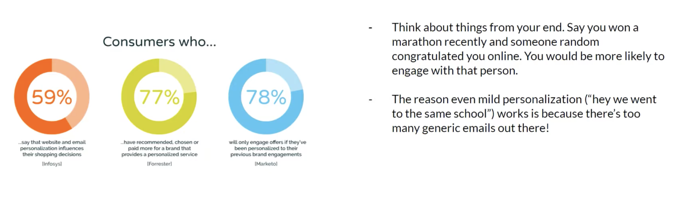
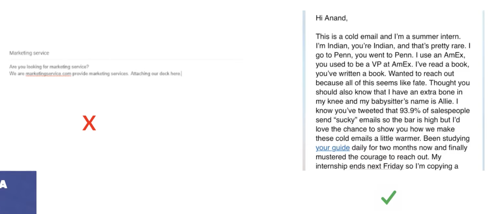

## **Follow ups!**

## **Cold call tips**

https://www.gong.io/resources/labs/cold-calling-tips/

## **What are leads anyway?**

- Use any method you can to build a relationship
- Find the best way to contact that relationship (SMS, email, LinkedIn, Twitter, etc)
- These leads actually become your network!
- **10 warm leads (where a relationship has been built) are better than 100 cold leads**
  
## **More relationship building tips**

- Podcasts
- Instagram DMs
- Events
- Host your own event
- Play football with VPs
- Golf (**seriously**)
- Media mentions
- Give things away for free
- **Account Based Marketing**

## **Referrals are key to getting massive**

- People are 4x more likely to buy when referred by a friend
- A referred customer has a 16% higher lifetime value than customers acquired through other means
- 83% of satisfied customers are willing to refer products and services

## **1 to many**

https://viral-loops.com/

## **Negotiating with the hero**

## **Objection Handling**

- Hubspot has the best resources for this, but all this is situational
  https://blog.hubspot.com/sales/handling-common-sales-objections

## **Closing**

- The deal isn't closed until the decision maker signs on the dotted line
- Most enterprise companies have procurement teams that have to sign off on a purchase
- Usually, software/goods below 10k INR per month are "credit card purchases" and are refundable
- Software/goods above that cost need to be approved by procurement teams
- **Enterprise deals take upto 2 years to close, by which time your point of contact might have changed jobs**
- It is better to have an enterprise deal (long, stable, high value) than a SMB deal (short, unstable, low value)
- Don't lose steam until you finish the close and money hits the account

# **Structuring a sales team**
## **What does scale mean in sales?**

## **The typical sales team**

## **It's not that hard**

## **Sales is a hard job...**

- **Burnout** happens to sales reps who don't meet their quota
- Regardless of how stressful a sales job is, making a good commission keeps people going
- Money tied to performance is a great motivator when performance is great, but a quick trip to burnout if the rep performs poorly

## **How to motivate your reps**

- Create a culture of public appreciation
- Use one team's victory to create internal competition
- Ask everyone to focus on weekly and daily targets instead of long quotas
- In sales, **rewards** are everything
- There's often no loyalty - you're only as good as your last season
- Make it Reds vs Blues :0
- Design and visualization is the best way to communicate internal strategy
- Create badges, posters, etc and hang it all over your walls
- 