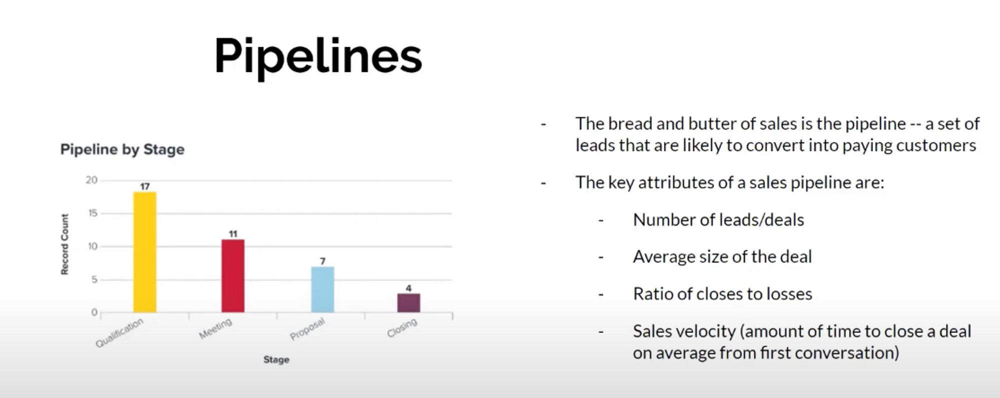
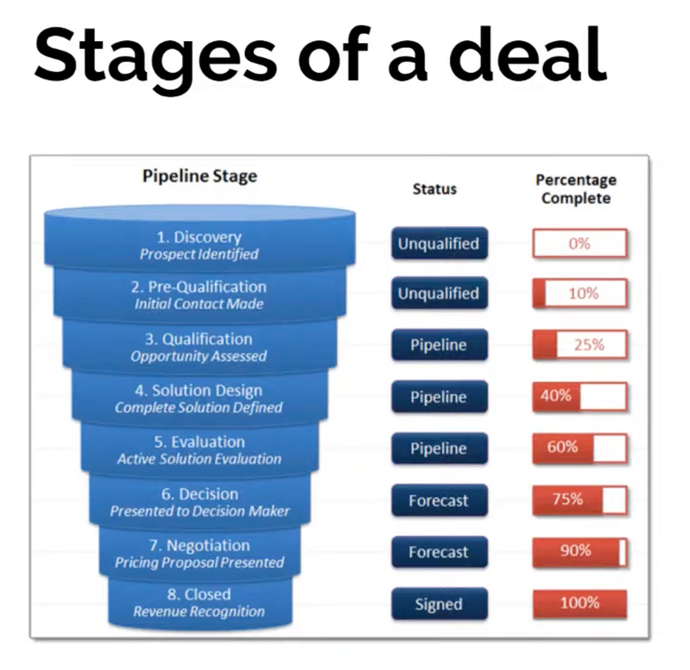
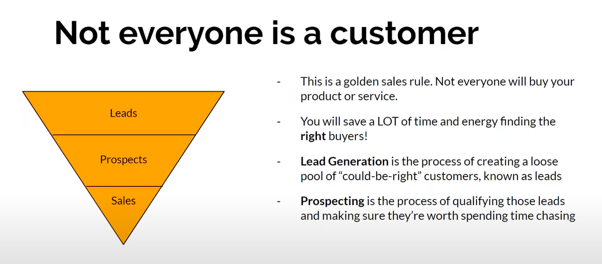
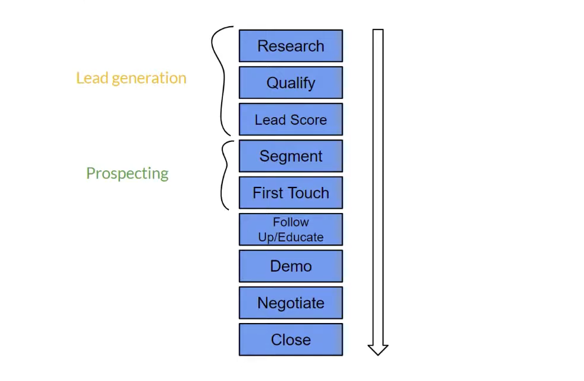
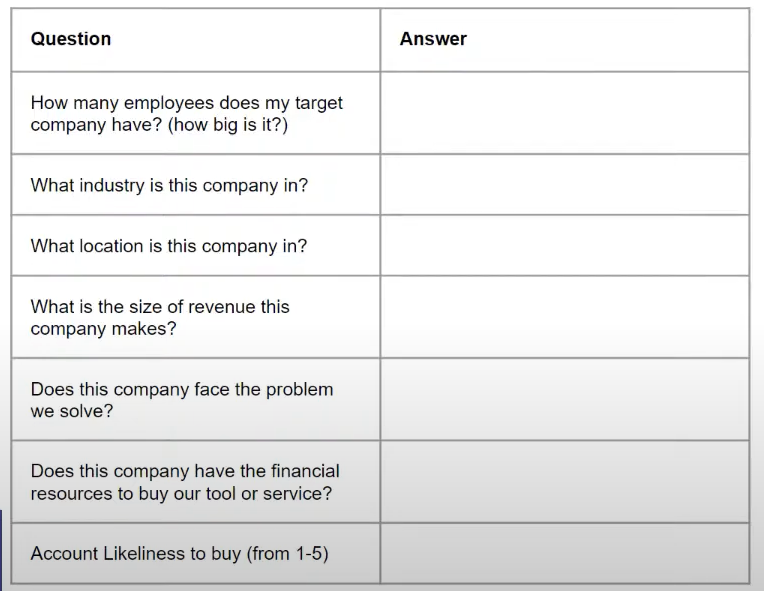
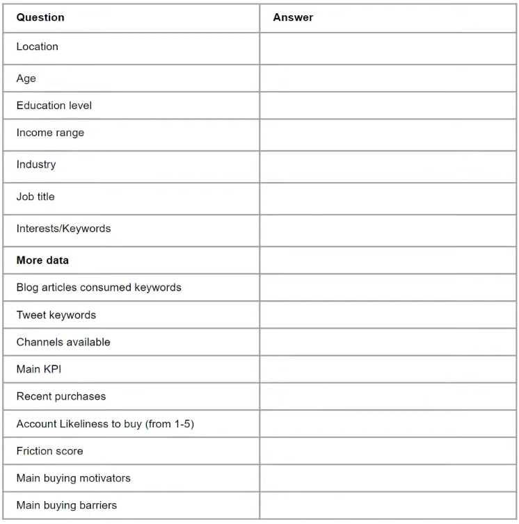

# VML2 Sales Notes

## You rarely sell to a company

- There’s no such thing as “selling to a company”
- Not all people can make decisions
- Always sell to ********************************decision makers********************************  at a company
- Sales is about 1:1 conversations or meetings
- There are many different ways you can find decision makers. and sell your products.

## **Friction**

- Friction is the amount of resistance between a customer and his purchase
- The more time you as a sales rep have to spend with a customer, the more friction there is
- High friction sales take a lot of time and effort

## **Calculating friction**

- Friction score = (time spent by sales rep) * (total number of decision makers)
- Friction is a marker of how low your sales velocity is. It is the inverse of sales velocity

## **Sales velocity**

- A measure of how fast you can close a deal
- If you are an entrepreneur, raise as much capital to cover 2x your sales velocity
- Avoid high friction, low velocity sales (Ex: selling to the government)

## **Prospecting**

- We prospect by creating an **ideal buyer persona**
- This is a hypothetical person who would be the perfect customer for your product
- Before we start prospecting and initiating conversation, we generate leads in a process called **lead generation**

## **Steps to Lead generation**

## **Lead generation - 1**

- Use the following matrix to map your ideal buyer persona
- But always remember, at the end of the day, you sell to a person, not a company
- This list just narrows down the companies you want to sell to

## **Lead generation - 2**

- Once you have figured out the companies you want to sell to, let's move to the buyer

- Now we need to start reaching out to people who fit the buyer persona we have identified
- Sometimes, you might need to reach out to somebody one level lower (bottom up approach) or one level higher (top down approach) than the buyer persona you have identified
- Sometimes, you might be entirely wrong about this persona, in which case, you have to go back to the drawing board and start over
- All of these things take experimentation and time, which is why speeding up how fast you run these persona tests is important!

## **Need a tool?**
- [Hubspot Make My Persona](https://www.hubspot.com/make-my-persona)